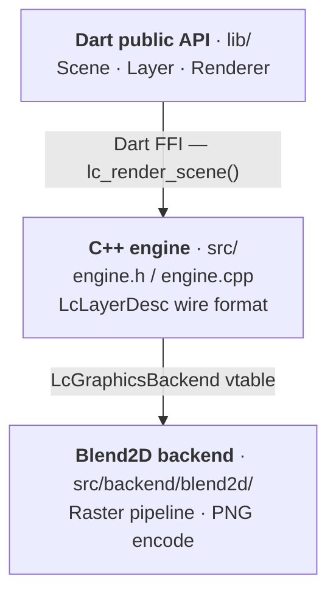

# layer_canvas

A high-performance 2D compositing engine for Flutter and Dart, backed by
[Blend2D](https://blend2d.com) via Dart FFI. Compose typed `Layer`s into a
`Scene` and render to PNG at native speed — on Android, iOS, macOS, Linux,
and Windows.

## Features

- **Typed layer model** — `RectangleLayer`, `TextLayer`, `ImageLayer`, `Group`
- **Native Blend2D renderer** — compiled as a [Dart Native Asset][native_assets],
  no separate build step, no CMake invocation needed
- **Full 2D transform** — position, rotation, scale, and configurable pivot
  anchor on every layer
- **Compositor semantics** — `zIndex`, `opacity`, `visible` respected on all
  layer types
- **No JIT / no AsmJit** — safe on W^X-constrained platforms (iOS App Store,
  Impeller on Android)
- **Extensible** — add new layer kinds by subclassing `Layer`; the engine core
  and `Scene` never change

## Platform support

| Platform | Architecture    | Status       |
|----------|-----------------|--------------|
| Android  | arm64-v8a       | ✅ Supported |
| Android  | x86\_64 (emulator) | ✅ Supported |
| iOS      | arm64           | ✅ Supported |
| macOS    | arm64 / x86\_64 | ✅ Supported |
| Linux    | x86\_64         | ✅ Supported |
| Windows  | x86\_64         | ✅ Supported |

## Getting started

Add to `pubspec.yaml`:

```yaml
dependencies:
  layer_canvas: ^0.0.1
```

No additional native build setup is required — the Blend2D library is compiled
and bundled automatically via Dart's Native Assets mechanism.

## Usage

### Basic render

```dart
import 'package:layer_canvas/layer_canvas.dart';

final scene = Scene(width: 800, height: 600);

scene.add(RectangleLayer(
  size: const Size2D(800, 600),
  paint: const LayerPaint(color: Color32.fromRGB(30, 30, 30)),
));

scene.add(RectangleLayer(
  transform: const LayerTransform(position: Point2D(100, 200)),
  size: const Size2D(200, 80),
  paint: const LayerPaint(
    color: Color32.fromARGB(200, 255, 255, 255),
    style: LayerPaintStyle.fillAndStroke,
    strokeWidth: 2,
  ),
  cornerRadius: 12,
));

final Uint8List png = await Renderer().render(scene);
// Use png as Image.memory(png) in Flutter, File.writeAsBytes(png), etc.
```

### Watermark overlay

```dart
final scene = Scene(width: 400, height: 300);

// Semi-transparent band at the bottom
scene.add(RectangleLayer(
  transform: const LayerTransform(position: Point2D(0, 240)),
  size: const Size2D(400, 60),
  paint: const LayerPaint(color: Color32(0xCC000000)), // 80 % black
));

// Rotated stamp at the center
scene.add(RectangleLayer(
  transform: LayerTransform(
    position: const Point2D(120, 130),
    rotation: -0.4, // ≈ -23°
  ),
  size: const Size2D(160, 40),
  paint: const LayerPaint(color: Color32(0x44FFFFFF)),
  cornerRadius: 6,
));

final png = await Renderer().render(scene);
```

### Write to file

```dart
await Renderer().renderToFile(scene, '/tmp/output.png');
```

## API overview

### `Scene`

The root of a composition. Holds canvas dimensions and an ordered list of
layers.

| Member | Description |
|---|---|
| `Scene({width, height, background})` | Creates a canvas. Both dimensions must be positive. |
| `add(Layer)` / `addAll(Iterable<Layer>)` | Appends layers in insertion order. |
| `remove(String id)` | Removes the layer with the given id. Returns `false` if not found. |
| `clear()` | Removes all layers. |
| `layers` | Unmodifiable view of the current layers. |
| `background` | Optional `LayerImageSource` painted before any layer. |

### `Layer` (base class)

Every element on a scene inherits these properties:

| Property | Type | Default | Description |
|---|---|---|---|
| `id` | `String` | auto | Stable identifier for this layer instance. |
| `transform` | `LayerTransform` | identity | Position, rotation, scale, anchor. |
| `size` | `Size2D?` | `null` | Explicit size; `null` means intrinsic (content-derived). |
| `opacity` | `double` | `1.0` | Compositing alpha, `0.0`–`1.0`. |
| `zIndex` | `int` | `0` | Stacking order (higher = on top). |
| `visible` | `bool` | `true` | Invisible layers are not sent to the native engine. |

### `LayerTransform`

```dart
const LayerTransform(
  position: Point2D(x, y),   // translation in logical pixels
  rotation: radians,          // clockwise rotation in radians
  scale: Point2D(sx, sy),    // per-axis scale factor
  anchor: Point2D(0.5, 0.5), // pivot as fraction of layer size (default: center)
)
```

### Concrete layer types

| Type | Status | Key properties |
|---|---|---|
| `RectangleLayer` | ✅ Native render | `paint`, `cornerRadius` |
| `ImageLayer` | 🔲 Model only | `source`, `fit` |
| `TextLayer` | 🔲 Model only | `text`, `fontSize`, `color`, `fontFamily`, `fontWeight`, `align` |
| `Group` | 🔲 Model only | `children` |

> **Note:** `ImageLayer`, `TextLayer`, and `Group` are part of the scene model
> and are silently skipped by the native renderer until their backend
> implementations are added. Scenes containing unsupported layer types never
> fail — only `RectangleLayer`s contribute pixels today.

### `Renderer`

```dart
const renderer = Renderer();

// Returns PNG bytes
final Uint8List bytes = await renderer.render(scene);

// Writes PNG to path
await renderer.renderToFile(scene, outputPath);
```

Throws `RenderException` (a subtype of `Exception`) if the native engine
returns a non-zero status code.

### `Color32`

An immutable 32-bit ARGB color. Packed as `0xAARRGGBB`.

```dart
const Color32(0xFF3A7BD5)          // hex literal
Color32.fromRGB(58, 123, 213)      // fully opaque
Color32.fromARGB(180, 58, 123, 213) // with alpha
Color32.white.withOpacity(0.5)     // derived color
```

### `LayerPaint`

```dart
const LayerPaint(
  color: Color32.fromRGB(255, 0, 0),
  style: LayerPaintStyle.fillAndStroke, // fill | stroke | fillAndStroke
  strokeWidth: 2.0,
)
```

### `LayerImageSource`

Describes where image data comes from without decoding it:

```dart
LayerImageSource.file('/path/to/image.png')
LayerImageSource.memory(bytes) // Uint8List of encoded image data
```

## Architecture



The engine core (`engine.cpp`) is decoupled from Blend2D through the
`LcGraphicsBackend` function-pointer table defined in `src/backend/backend.h`.
Swapping to a different graphics library means implementing that table and
changing one line in `engine.cpp` — nothing in the public API or `Scene` model
changes.

## Building from source

The native library is compiled automatically by `hook/build.dart` using
`package:native_toolchain_c`. No manual invocation is needed; `flutter run`,
`dart test`, and `dart build` all trigger it.

To regenerate the Dart FFI bindings after modifying `src/engine.h`:

```sh
dart run ffigen --config ffigen.yaml
```

## Running tests

```sh
dart test
```

## Running benchmarks

```sh
dart run benchmark/render_benchmark.dart
```

[native_assets]: https://dart.dev/interop/c-interop#native-assets
