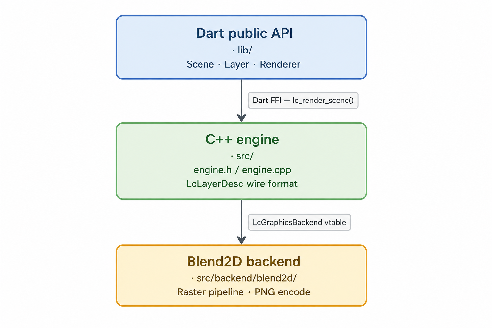

# layer_canvas — full guide

Back to the [project README](../README.md) for the quick start and
installation. This page covers every layer type, the full public API, and
how to build/test/benchmark the package.

**Contents**

- [Usage](#usage)
  - [Basic render](#basic-render)
  - [Gradients](#gradients)
  - [Paths and polygons](#paths-and-polygons)
  - [Watermark overlay](#watermark-overlay)
  - [Images](#images)
  - [Text](#text)
  - [Custom fonts](#custom-fonts)
  - [Opting out of the embedded default font](#opting-out-of-the-embedded-default-font)
  - [Groups](#groups)
  - [SVG import](#svg-import)
  - [Write to file](#write-to-file)
- [API overview](#api-overview)
  - [`Scene`](#scene)
  - [`Layer` (base class)](#layer-base-class)
  - [`LayerTransform`](#layertransform)
  - [Concrete layer types](#concrete-layer-types)
  - [`Renderer`](#renderer)
  - [`FontRegistry`](#fontregistry)
  - [`SvgDocument`](#svgdocument)
  - [`Color32`](#color32)
  - [`LayerPaint`](#layerpaint)
  - [`LayerImageSource`](#layerimagesource)
- [Architecture](#architecture)
- [Building from source](#building-from-source)
- [Running tests](#running-tests)
- [Running benchmarks](#running-benchmarks)
  - [Cross-tool comparison](#cross-tool-comparison)

## Usage

### Basic render

```dart
import 'package:layer_canvas/layer_canvas.dart';

final scene = Scene(width: 800, height: 600);

// .filled skips building Size2D/LayerPaint for the common solid-color case.
scene.add(RectangleLayer.filled(
  width: 800,
  height: 600,
  color: Color32.fromRGB(30, 30, 30),
));

// The main constructor is still there for stroke/fillAndStroke/gradients.
scene.add(RectangleLayer(
  transform: const LayerTransform(position: Point2D(100, 200)),
  size: const Size2D(200, 80),
  paint: const LayerPaint(
    color: Color32.fromARGB(200, 255, 255, 255),
    style: LayerPaintStyle.fillAndStroke,
    strokeWidth: 2,
  ),
  cornerRadius: 12,
));

final Uint8List png = await Renderer().render(scene);
// Use png as Image.memory(png) in Flutter, File.writeAsBytes(png), etc.
```

### Gradients

`LayerPaint.gradient` paints a shape's fill and stroke with a gradient
instead of a solid `color`. Geometry (`start`/`end`, `center`, `radius`,
`angle`) is fractional (`0.0`–`1.0`), relative to the painted layer's own
size — it inherits the layer's rotation/scale automatically:

```dart
scene.add(RectangleLayer(
  size: const Size2D(400, 120),
  paint: LayerPaint(
    gradient: LinearGradient.colors(
      start: const Point2D(0, 0),
      end: const Point2D(1, 0),
      colors: [Color32.fromRGB(255, 0, 0), Color32.fromRGB(0, 0, 255)],
      extendMode: GradientExtendMode.pad, // pad | repeat | reflect
    ),
  ),
));
```

`.colors` takes `colors` and an optional `stops` (each color's `0.0`–`1.0`
position) — omit `stops` and they're spaced evenly, so two colors alone
is enough for a simple gradient, the same way Flutter's own
`LinearGradient` works. For uneven spacing, or when you want each color's
alpha/position spelled out explicitly, build the full `GradientStop` list
yourself with the main constructor:

```dart
LinearGradient(
  start: const Point2D(0, 0),
  end: const Point2D(1, 0),
  stops: const [
    GradientStop(0, Color32.fromRGB(255, 0, 0)),
    GradientStop(0.8, Color32.fromRGB(0, 0, 255)), // 80% of the way, not 100%
    GradientStop(1, Color32.fromRGB(0, 0, 0)),
  ],
)
```

`LinearGradient`, `RadialGradient`, and `ConicGradient` are all supported,
each with its own `.colors` factory alongside the main constructor.

### Paths and polygons

`PathLayer` draws arbitrary vector geometry — lines and Bézier curves, or a
closed/open shape built from a list of vertices:

```dart
// A polygon from vertices — closed automatically. .filled skips building
// LayerPaint for the common solid-color case (same as RectangleLayer.filled).
scene.add(PathLayer.filled(
  path: LayerPath.polygon([
    Point2D(200, 20),
    Point2D(380, 280),
    Point2D(20, 280),
  ]),
  color: Color32.fromRGB(0, 180, 90),
));

// A hand-built path with a curve, using the main constructor for a
// non-default paint style.
scene.add(PathLayer(
  path: LayerPath([
    MoveTo(Point2D(20, 100)),
    CubicBezierTo(Point2D(20, 20), Point2D(180, 20), Point2D(180, 100)),
    LineTo(Point2D(180, 160)),
    ClosePath(),
  ]),
  paint: const LayerPaint(color: Color32.fromRGB(58, 123, 213)),
));
```

Point coordinates are absolute, in the layer's own local space — the same
origin `(0, 0)` a `RectangleLayer` draws into — not fractional like
gradients. `LayerPath.polyline` builds an open shape; since the default
paint `style` is `fill` (which implicitly closes an open path), pass
`paint: LayerPaint(style: LayerPaintStyle.stroke)` if you want it drawn as
an outline instead. `fillRule` (`FillRule.nonZero` or `.evenOdd`) controls
how self-intersecting shapes (e.g. a five-pointed star drawn as one
outline) fill.

`LayerPath.circle`/`.ellipse` build a full circle/ellipse — no arc-flag
arithmetic to reason about:

```dart
scene.add(PathLayer.filled(
  path: LayerPath.circle(const Point2D(100, 100), 100),
  color: Color32.fromRGB(0, 180, 90),
));
```

Under the hood, `.circle`/`.ellipse` are built from two semicircular
`ArcTo` commands — `ArcTo` draws an elliptical arc using the same endpoint
parameterization as SVG's `A`/`a` path command (`radiusX`/`radiusY`, an
optional `xAxisRotation`, and `largeArc`/`sweep` to resolve which of the
up to four matching ellipses to use), and is there directly for partial
arcs/pie slices that `.circle`/`.ellipse` don't cover:

```dart
// Equivalent to LayerPath.circle(Point2D(100, 100), 100) above, spelled
// out by hand — two semicircular arcs between diametrically opposite
// points.
scene.add(PathLayer(
  path: LayerPath([
    MoveTo(Point2D(200, 100)),
    ArcTo(radiusX: 100, radiusY: 100, sweep: true, point: Point2D(0, 100)),
    ArcTo(radiusX: 100, radiusY: 100, sweep: true, point: Point2D(200, 100)),
    ClosePath(),
  ]),
  paint: const LayerPaint(color: Color32.fromRGB(0, 180, 90)),
));
```

### Watermark overlay

```dart
final scene = Scene(width: 400, height: 300);

// Semi-transparent band at the bottom
scene.add(RectangleLayer(
  transform: const LayerTransform(position: Point2D(0, 240)),
  size: const Size2D(400, 60),
  paint: const LayerPaint(color: Color32(0xCC000000)), // 80 % black
));

// Rotated stamp at the center
scene.add(RectangleLayer(
  transform: LayerTransform(
    position: const Point2D(120, 130),
    rotation: -0.4, // ≈ -23°
  ),
  size: const Size2D(160, 40),
  paint: const LayerPaint(color: Color32(0x44FFFFFF)),
  cornerRadius: 6,
));

final png = await Renderer().render(scene);
```

### Images

```dart
final scene = Scene(width: 400, height: 300);

scene.add(ImageLayer(
  source: LayerImageSource.file('/path/to/photo.jpg'), // or .memory(bytes)
  size: const Size2D(400, 300),
  fit: ImageFit.cover,
));

final png = await Renderer().render(scene);
```

Blend2D decodes PNG/JPEG/BMP/QOI automatically (no format needs to be
specified). `fit` behaves like `BoxFit` in Flutter — `fill` stretches to
the given `size` ignoring aspect ratio, `contain` scales uniformly and
letterboxes, `cover` scales uniformly and crops, `none` draws at the
decoded image's natural pixel size. Without an explicit `size`, `none`'s
natural-size behavior is used regardless of `fit`.

For a full-canvas photo underneath everything else — the common case for a
watermark — `Scene.background` is shorter than an `ImageLayer` and always
covers the whole canvas:

```dart
final scene = Scene(
  width: 400,
  height: 300,
  background: LayerImageSource.file('/path/to/photo.jpg'),
);
```

### Text

```dart
final scene = Scene(width: 400, height: 120);

scene.add(TextLayer(
  text: '6.2442° N, 75.5812° W',
  transform: const LayerTransform(position: Point2D(16, 16)),
  size: const Size2D(368, 30),
  fontSize: 20,
  color: Color32.white,
  align: TextAlignment.left,
));

scene.add(TextLayer(
  text: 'MEDELLÍN, COLOMBIA',
  transform: const LayerTransform(position: Point2D(16, 56)),
  size: const Size2D(368, 30),
  fontSize: 16,
  color: Color32.fromRGB(255, 200, 0),
  align: TextAlignment.center,
  fontWeight: TextWeight.bold,
));

final png = await Renderer().render(scene);
```

`TextLayer` renders natively (no Flutter widgets involved) using an embedded
Roboto — `fontWeight` values `>= 600` pick the bold face, everything else
regular. Alignment is honored within `size`'s width; without an explicit
`size`, text is drawn from `transform.position` with no wrapping.

### Custom fonts

Register your own TTF/OTF bytes once (e.g. at app startup) and reference
them by name from any `TextLayer`:

```dart
final data = await File('assets/fonts/Brand-Regular.ttf').readAsBytes();
FontRegistry.register('Brand', data);

scene.add(TextLayer(
  text: 'On brand',
  fontFamily: 'Brand', // falls back to the embedded Roboto if unregistered
));
```

Registration is global to the process, not scoped to a `Scene` or
`Renderer` — call it once, use the name everywhere.

A single family name can have several weights registered at once — pass
`weight` (defaults to `TextWeight.normal`) to register more than one:

```dart
FontRegistry.register('Brand', regularData);
FontRegistry.register('Brand', boldData, weight: TextWeight.bold);

scene.add(TextLayer(
  text: 'On brand, bold',
  fontFamily: 'Brand',
  fontWeight: TextWeight.bold, // resolves to boldData above
));
```

A `TextLayer` renders with whichever registered weight under that family is
numerically closest to its own `fontWeight` — registering only `normal` and
`bold` still gives every weight in between (and beyond) a reasonable match,
instead of every weight collapsing onto a single face.

### Opting out of the embedded default font

`TextLayer` ships with an embedded Roboto (regular and bold) so it works
out of the box, at a cost of roughly 1.4 MB in the compiled native
library. Apps that never use `TextLayer`, or that always register their
own font via `FontRegistry`, can drop it by adding this to their own
`pubspec.yaml` (not this package's):

```yaml
hooks:
  user_defines:
    layer_canvas:
      embed_default_font: false
```

With this set, a `TextLayer` that doesn't match a font registered via
`FontRegistry` renders nothing for that layer — the rest of the scene
still renders normally — instead of falling back to Roboto.

### Groups

```dart
scene.add(Group(
  transform: const LayerTransform(position: Point2D(50, 400), rotation: 0.1),
  opacity: 0.9,
  children: [
    RectangleLayer(size: const Size2D(200, 60), paint: const LayerPaint(color: Color32(0xAA000000))),
    TextLayer(text: 'Grouped', transform: const LayerTransform(position: Point2D(12, 18)), color: Color32.white),
  ],
));
```

A `Group`'s `transform` and `opacity` apply to every child as one unit —
move, rotate, or fade the whole cluster without touching each child's own
values. Groups can nest arbitrarily and never reach the native engine: the
renderer flattens them into concrete layers first.

### SVG import

`SvgDocument` parses SVG source into this package's existing layer types
(`PathLayer`, `Group`) — there's no separate `SvgLayer` type; an imported
document is just a `Group` like any other, parsed once rather than
re-parsed on every render:

```dart
final doc = SvgDocument.parse(await File('assets/logo.svg').readAsString());

scene.add(doc.toGroup(
  transform: const LayerTransform(position: Point2D(20, 20)),
));
```

`doc.naturalSize` (from the SVG's `viewBox` or `width`/`height`) tells you
the document's own coordinate scale, so you can size it like any other
layer — e.g. to fit a 64×64 slot:

```dart
final scale = doc.naturalSize == null
    ? const Point2D(1, 1)
    : Point2D(64 / doc.naturalSize!.width, 64 / doc.naturalSize!.height);

scene.add(doc.toGroup(transform: LayerTransform(scale: scale)));
```

Supported: `<rect>` (including rounded corners), `<circle>`, `<ellipse>`,
`<line>`, `<polyline>`, `<polygon>`, `<path>` (the full `d` mini-language:
lines, quadratic/cubic Béziers, and elliptical arcs), `<g>` groups,
`<linearGradient>`/`<radialGradient>` referenced via `fill="url(#id)"`/
`stroke="url(#id)"`, and the usual presentation attributes (`fill`,
`stroke`, `stroke-width`, `fill-opacity`, `stroke-opacity`, `opacity`,
`fill-rule`, `transform`, plus a basic `style="..."` attribute) with
normal CSS-style inheritance down `<g>` trees. All ~147 CSS/SVG named
colors are recognized, alongside hex and `rgb()`/`rgba()`.

Every SVG `transform` (including shear, which `LayerTransform` can't
represent) is baked directly into each shape's absolute path coordinates
at parse time — an elliptical arc under a plain translate/rotate/uniform-
scale stays an exact arc; under shear or non-uniform scale it's
approximated with cubic Béziers instead, since a Bézier's control points
transform correctly under any affine map.

Not supported (skipped, doesn't fail the parse): CSS stylesheets
(`<style>` blocks/selectors), `<use>`/`<symbol>`/`<clipPath>`/`<mask>`/
`<pattern>`, `<text>`, filters, embedded raster `<image>`, SMIL
animations, `gradientTransform`, `gradientUnits="userSpaceOnUse"`, and
`preserveAspectRatio` values other than the default (uniform scale-to-fit,
centered). Malformed XML throws `SvgParseException`; malformed or
unsupported *content* within otherwise well-formed SVG is skipped
element-by-element instead.

### Write to file

```dart
await Renderer().renderToFile(scene, '/tmp/output.png');
```

## API overview

### `Scene`

The root of a composition. Holds canvas dimensions and an ordered list of
layers.

| Member | Description |
|---|---|
| `Scene({width, height, background})` | Creates a canvas. Both dimensions must be positive. |
| `add(Layer)` / `addAll(Iterable<Layer>)` | Appends layers in insertion order. |
| `remove(String id)` | Removes the layer with the given id. Returns `false` if not found. |
| `clear()` | Removes all layers. |
| `layers` | Unmodifiable view of the current layers. |
| `background` | Optional `LayerImageSource` painted before any layer, scaled to cover the whole canvas (like an implicit full-size `ImageLayer` with `fit: ImageFit.cover`, regardless of any layer's `zIndex`). |

### `Layer` (base class)

Every element on a scene inherits these properties:

| Property | Type | Default | Description |
|---|---|---|---|
| `id` | `String` | auto | Stable identifier for this layer instance. |
| `transform` | `LayerTransform` | identity | Position, rotation, scale, anchor. |
| `size` | `Size2D?` | `null` | Explicit size; `null` means intrinsic (content-derived). |
| `opacity` | `double` | `1.0` | Compositing alpha, `0.0`–`1.0`. |
| `zIndex` | `int` | `0` | Stacking order (higher = on top). |
| `visible` | `bool` | `true` | Invisible layers are not sent to the native engine. |

### `LayerTransform`

```dart
const LayerTransform(
  position: Point2D(x, y),   // translation in logical pixels
  rotation: radians,          // clockwise rotation in radians
  scale: Point2D(sx, sy),    // per-axis scale factor
  anchor: Point2D(0.5, 0.5), // pivot as fraction of layer size (default: center)
)
```

### Concrete layer types

| Type | Status | Key properties |
|---|---|---|
| `RectangleLayer` | ✅ Native render | `paint`, `cornerRadius` |
| `TextLayer` | ✅ Native render | `text`, `fontSize`, `color`, `fontFamily`, `fontWeight`, `align` |
| `Group` | ✅ Flattened before render | `children` |
| `ImageLayer` | ✅ Native render | `source`, `fit` |
| `PathLayer` | ✅ Native render | `path`, `paint`, `fillRule` |

> **Note:** `Group` never reaches the native engine — the renderer expands
> it into its concrete descendants first, composing the group's
> transform/opacity into each one (see `scene_flattener.dart`), so
> `scene_desc.h` and the Blend2D backend need no changes to support it.

### `Renderer`

```dart
const renderer = Renderer();

// Returns PNG bytes
final Uint8List bytes = await renderer.render(scene);

// Writes PNG to path
await renderer.renderToFile(scene, outputPath);
```

Throws `RenderException` (a subtype of `Exception`) if the native engine
returns a non-zero status code.

### `FontRegistry`

```dart
FontRegistry.register('Brand', ttfBytes); // Uint8List of raw TTF/OTF data
FontRegistry.register('Brand', boldTtfBytes, weight: TextWeight.bold);
FontRegistry.unregister('Brand'); // removes the TextWeight.normal variant
FontRegistry.unregister('Brand', weight: TextWeight.bold);
```

Global to the process — registered fonts are available to every `Scene`
rendered afterward, by any `Renderer`. `register` throws a
`FontRegistrationException` if `ttfBytes` isn't valid font data. Both
methods default `weight` to `TextWeight.normal`; registering several
weights under the same name lets a `TextLayer` pick whichever is closest to
its own `fontWeight` (see [Custom fonts](#custom-fonts)).

### `SvgDocument`

```dart
final doc = SvgDocument.parse(svgSource); // String

doc.naturalSize;   // Size2D? — from viewBox or width/height
doc.toGroup(...);  // -> Group, same params as Group's constructor
```

Parses once (not on every render); throws `SvgParseException` for
malformed XML. See [SVG import](#svg-import) for supported elements.

### `Color32`

An immutable 32-bit ARGB color. Packed as `0xAARRGGBB`.

```dart
const Color32(0xFF3A7BD5)          // hex literal
Color32.fromRGB(58, 123, 213)      // fully opaque
Color32.fromARGB(180, 58, 123, 213) // with alpha
Color32.white.withOpacity(0.5)     // derived color
```

### `LayerPaint`

```dart
const LayerPaint(
  color: Color32.fromRGB(255, 0, 0),
  style: LayerPaintStyle.fillAndStroke, // fill | stroke | fillAndStroke
  strokeWidth: 2.0,
  gradient: null, // Linear/Radial/ConicGradient — see Gradients above
)
```

`gradient`, when set, paints both fill and stroke instead of `color`.

### `LayerImageSource`

Describes where image data comes from without decoding it:

```dart
LayerImageSource.file('/path/to/image.png')
LayerImageSource.memory(bytes) // Uint8List of encoded image data
```

## Architecture



The engine core (`engine.cpp`) is decoupled from Blend2D through the
`LcGraphicsBackend` function-pointer table defined in `src/backend/backend.h`.
Swapping to a different graphics library means implementing that table and
changing one line in `engine.cpp` — nothing in the public API or `Scene` model
changes.

## Building from source

The native library is compiled automatically by `hook/build.dart` using
`package:native_toolchain_c`. No manual invocation is needed; `flutter run`,
`dart test`, and `dart build` all trigger it.

To regenerate the Dart FFI bindings after modifying `src/engine.h`:

```sh
dart run ffigen --config ffigen.yaml
```

## Running tests

```sh
dart test
```

## Running benchmarks

```sh
dart run benchmark/render_benchmark.dart
```

### Cross-tool comparison

The same six scenes (`empty`, `singleRect`, `watermark`, `rects10`,
`rects50`, `largeCanvas10` — same canvas sizes, positions, colors, corner
radii, and one rotated/translucent shape) are rendered through three
different rendering paths, so the reports can be compared side by side:

```sh
# layer_canvas (Blend2D via FFI)
dart run benchmark/render_benchmark.dart

# package:image — pure Dart, no native backend
dart run benchmark/image_package_benchmark.dart

# dart:ui — Flutter's own Canvas/Skia, rasterized headlessly
cd benchmark_dart_ui
flutter pub get
flutter test test/dart_ui_benchmark_test.dart
```

`benchmark_dart_ui/` is a separate, standalone Flutter project (its own
`pubspec.yaml`) — the only place in this repo that depends on Flutter.
`dart:ui` can't rasterize outside a Flutter engine, and `layer_canvas`
itself stays Flutter-free (see the [project README](../README.md)), so
that comparison couldn't live in the main package's own `dev_dependencies`
without contradicting that.

---

Back to the [project README](../README.md).
